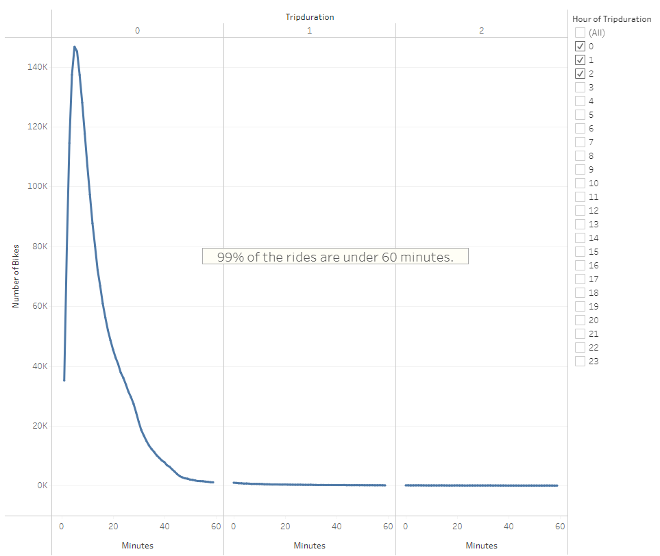
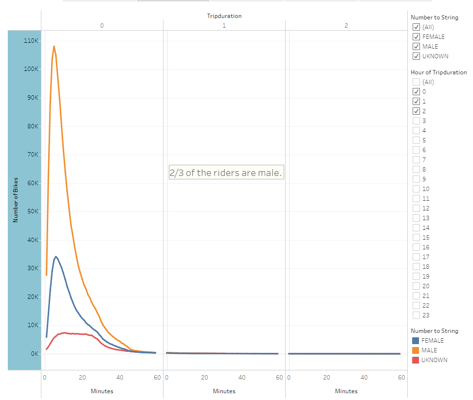
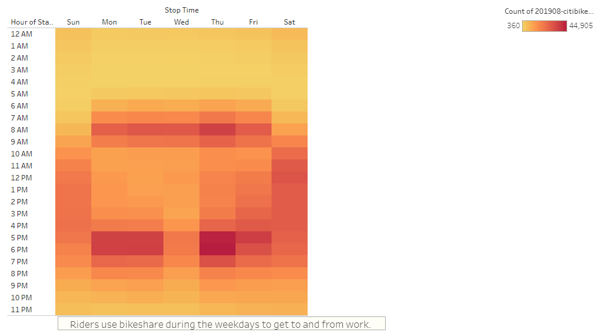
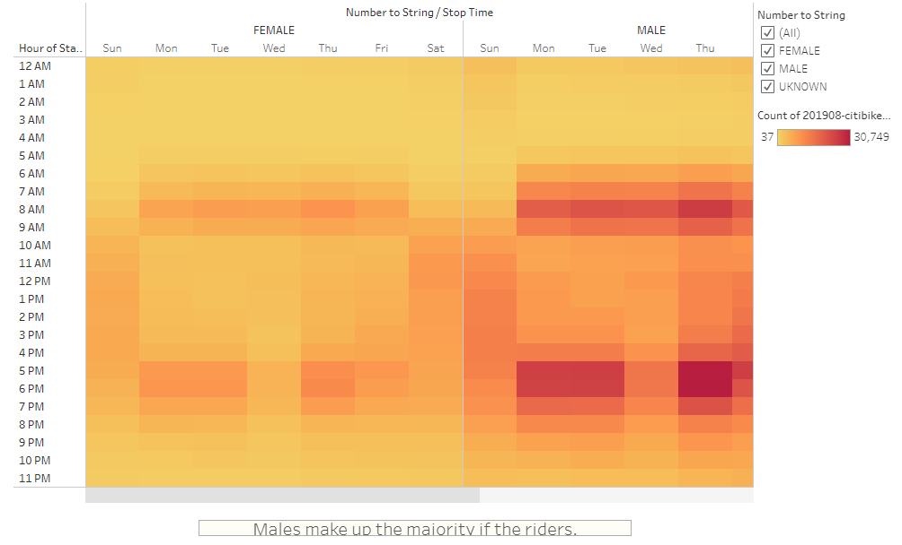
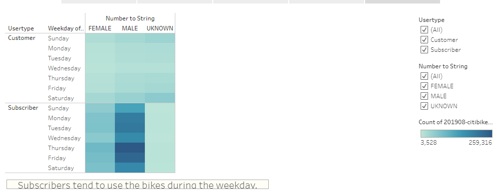

# Bike Sharing
Using Tableau to vizulize data. 

## Purpose
The purpose of this challenge is to provide a business proposal with compelling visulizations that will convince investors that developing a bike-sharing program in Des Moines,IA can be a profitable venture. We used data that is publicly available from the NYC CitiBike program archives and Tableau to create dynamic visualizations.

The data is based on activity is based off of New York City's bike sharing program. We use our data expertise and critical thinking skills to build a story that can be presented to the investors.

For our presentation, we decide to use data from  the busiest month of the bike sharing program, August 2019, to build our analysis. 

## Link to Dashboard
[link to dashboard](https://public.tableau.com/app/profile/danielle.askew1345/viz/NYCBikeSharingProgram_16453185183510/Story2?publish=yes)

## Results

- Almost all of the trips (99%) were under 60 minutes and 49% under 10 minutes (1.1M vs. 2.3M).

- Male riders make up the primary users of the bike share program with 65% of the riders. Leaving the remaining being 25% female and 10% unknown.

- Most of the rides during the weekdays occur during commuting hours of 8-9am and 5-7pm. It seems the bike sharing program preferred for commuting to and from work.

- Again we see Male riders are more inclined to use the bike sharing program.

- Thursday has the highest usage day among subscribers and the most usage occurring on Saturday for non-subscribers.

## Summary
To summarize:
- Stalls located in heavily concentrated business areas, such as Midtown and Downtown had the majority of the usage.
- Subscribers are the primary user.
- The duration of most trips were under 10 minutes.

Based off our results in NYC introducing a bike share program in Des Moines, IA may be a good business venture. From our data we know it would be better to install stalls in densely populated areas where mass transportation is highly used and parking is limited. 
We may suggest that visualization maps are created based on:
- Usage from starting to ending location to determine the distance traveled. Where are users starting their trip from and why? Are they using the bike to complete their commute after taking the bus or the train?
- By age group and adding demographic information to identify areas in which bikeshares would most likely be used (i.e. census data).
- By month for an entire year to identify how weather affects usage.

It may be better to also review data in cities that may be a closer match to the population, size and traffic pattern of Des Moines. While NYC painted a good picture for our analysis, limiting it to activity in NYC only may not be the most appropriate comparison as NYC has a very large commuter population, as well as higher people traffic from tourism.
